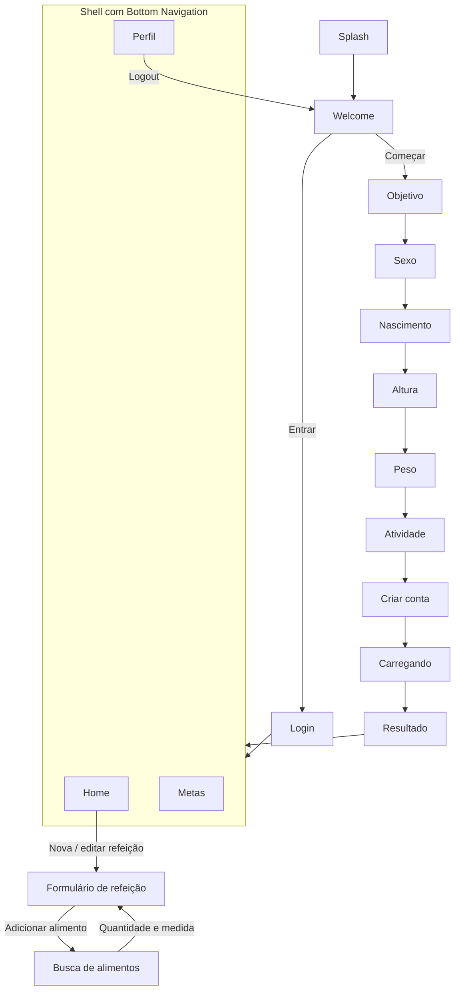

# Oz — Contador de Calorias

Aplicativo mobile em Flutter para acompanhamento diário de calorias e
macronutrientes (carboidratos, proteínas e gorduras). A partir de um
onboarding curto, o app calcula a meta calórica do usuário e permite
registrar, editar e excluir refeições, acompanhando o progresso do dia.

> **Entrega 2 em andamento.** Os dados ficam salvos no aparelho (SQLite com
> drift) e o app funciona offline. O login usa Supabase Auth (e-mail/senha e
> Google). A sincronização dos dados com o servidor vem na próxima etapa. As decisões de arquitetura
> estão em [`docs/arquitetura.md`](docs/arquitetura.md).

---

## Sumário

1. [Funcionalidades](#funcionalidades)
2. [Instalação e configuração](#instalação-e-configuração)
3. [Arquitetura e padrão de projeto](#arquitetura-e-padrão-de-projeto)
4. [Navegação entre páginas](#navegação-entre-páginas)
5. [Validações, mensagens de erro e tratamento de dados](#validações-mensagens-de-erro-e-tratamento-de-dados)
6. [Particularidades, limitações e bugs conhecidos](#particularidades-limitações-e-bugs-conhecidos)
7. [Equipe e atividades desenvolvidas](#equipe-e-atividades-desenvolvidas)

---

## Funcionalidades

- **Splash e boas-vindas** com opção de criar conta ou entrar.
- **Login** com validação de e-mail e senha.
- **Onboarding em 7 etapas**: objetivo, sexo, data de nascimento, altura,
  peso, nível de atividade e criação de conta, seguido de tela de
  carregamento e resultado com a meta calculada.
- **Cálculo de metas** pela fórmula de Mifflin-St Jeor × fator de atividade,
  com ajuste pelo objetivo (−500 kcal para perder, +300 kcal para ganhar) e
  distribuição de macros (2,2 g de proteína/kg, 25% das calorias em gordura,
  restante em carboidratos).
- **Home** com seletor de dia, gráfico de calorias/macros consumidos e lista
  de refeições do dia.
- **Refeições**: cadastro, edição e exclusão (com diálogo de confirmação).
  O usuário busca cada alimento e informa só a quantidade (em gramas ou em
  medida caseira, como fatia ou colher); calorias e macros vêm da base de
  alimentos e são somados automaticamente.
- **Metas**: edição manual da meta de calorias e de macros.
- **Perfil**: edição de nome, altura e peso, com recálculo das metas quando
  peso ou altura mudam, e logout.
- **Idioma**: app todo em português (pt-BR), com textos centralizados em `AppStrings`.
- **Tema escuro** com tokens de cor e tipografia (fonte Host Grotesk).

---

## Instalação e configuração

### Pré-requisitos

| Ferramenta                  | Versão                                     |
| --------------------------- | ------------------------------------------ |
| Flutter SDK                 | 3.47 ou superior (canal stable)            |
| Dart SDK                    | ^3.13.2 (já incluso no Flutter)            |
| Android Studio **ou** Xcode | Para emuladores/simuladores e build nativo |
| Git                         | Qualquer versão recente                    |

Confira se o ambiente está pronto:

```bash
flutter doctor
```

### Passo a passo

1. **Clone o repositório**

   ```bash
   git clone <url-do-repositorio>
   cd oz_contador_de_calorias
   ```

2. **Instale as dependências**

   ```bash
   flutter pub get
   ```

3. **Abra um emulador/simulador ou conecte um dispositivo**

   ```bash
   flutter devices
   ```

4. **Execute o app**

   ```bash
   flutter run --dart-define-from-file=config/dev.json
   ```

   O arquivo `config/dev.json` liga o app ao Supabase e ao login com Google;
   veja [`docs/configuracao-supabase.md`](docs/configuracao-supabase.md).
   Sem ele (`flutter run`), o app roda com uma sessão local e a conta de
   demonstração.

5. **Rode os testes (opcional)**

   ```bash
   flutter test
   ```

### Configurações relevantes

| Item                   | Onde fica                                        | Observação                                                                       |
| ---------------------- | ------------------------------------------------ | -------------------------------------------------------------------------------- |
| Dependências           | `pubspec.yaml`                                   | `provider`, `intl`, `uuid`, `drift`, `supabase_flutter`, `google_sign_in`, `flutter_secure_storage` |
| Backend                | `supabase/migrations/`, `config/dev.json`        | Schema, RLS e exclusão de conta; chaves fora do git (modelo em `config/dev.example.json`) |
| Banco local            | `lib/database/`                                  | Tabelas do drift; após alterá-las, rode `dart run build_runner build`            |
| Catálogo de alimentos  | `assets/data/foods.json`                         | TACO 4ª ed. + medidas caseiras do IBGE; gerado por `tool/food_catalog/build_catalog.py` |
| Textos                 | `lib/configs/strings/app_strings.dart`           | Todos os textos da interface, em português                                       |
| Tema e cores           | `lib/configs/theme/`                             | Apenas tema escuro                                                               |
| Constantes de nutrição | `lib/configs/constants/nutrition_constants.dart` | Fatores de atividade, kcal por grama de cada macro, limites de altura/peso/idade |
| Constantes de UI       | `lib/configs/constants/app_constants.dart`       | Espaçamentos, raios, durações de splash/loading                                  |
| Dados de exemplo       | `lib/mocks/`                                     | Conta de demonstração do login e dados dos testes (valores aproximados da TACO)  |
| Idioma                 | `lib/app.dart`                                   | Fixo em pt-BR; `flutter_localizations` traduz os widgets do Flutter (calendário) |

---

## Arquitetura e padrão de projeto

O projeto segue o padrão **MVC (Model–View–Controller)** com gerenciamento de
estado via **Provider**:

| Camada         | Pasta                        | Responsabilidade                                                                                                    |
| -------------- | ---------------------------- | ------------------------------------------------------------------------------------------------------------------- |
| **Model**      | `lib/models/`                | Entidades imutáveis (`UserProfile`, `Meal`, `MealItem`, `Food`, `FoodPortion`, `DailyLog`, `NutritionGoal`) e enums |
| **View**       | `lib/pages/`, `lib/widgets/` | Telas e componentes reutilizáveis; só exibem dados e repassam ações aos controllers                                 |
| **Controller** | `lib/controllers/`           | `ChangeNotifier`s que guardam o estado e as regras de cada fluxo                                                    |
| **Services**   | `lib/services/`              | Lógica pura e testável: cálculo nutricional, validadores e utilitários de data e texto                              |
| **Repository** | `lib/repositories/`          | Acesso a dados atrás de interfaces (`Food`, `Meal`, `Profile`, `Session`), com implementações em drift e mocks para testes |

### Estrutura de pastas

```
lib/
├── main.dart                 # Ponto de entrada
├── app.dart                  # MultiProvider, MaterialApp, tema, idioma e rotas
├── configs/
│   ├── constants/            # Constantes de UI e de nutrição
│   ├── strings/              # Textos (AppStrings), rótulos e formatação de números
│   ├── routes/               # Nomes de rotas e RouteGenerator
│   └── theme/                # Cores, tipografia e ThemeData
├── controllers/              # Session, Onboarding, Profile, DailyLog, Meal, FoodSearch
├── database/                 # Banco local (drift): tabelas, IDs e catálogo inicial
├── mocks/                    # Conta de demonstração e dados de teste
├── models/                   # Entidades e enums
├── pages/                    # Uma pasta por tela/fluxo
├── repositories/             # Interfaces de acesso a dados e implementações
├── services/                 # NutritionCalculator, Validators, DateUtils, TextUtils
└── widgets/                  # Botões, inputs, cards, gráficos, navbar, etc.
```

### Controllers

| Controller             | Responsabilidade                                                                                                         |
| ---------------------- | ------------------------------------------------------------------------------------------------------------------------ |
| `SessionController`    | Estado de autenticação (login/logout)                                                                                    |
| `OnboardingController` | Guarda as respostas do onboarding e monta o `UserProfile`                                                                |
| `ProfileController`    | Perfil do usuário e metas; recalcula metas quando peso/altura mudam                                                      |
| `DailyLogController`   | Dia selecionado na Home e refeições agrupadas por dia                                                                    |
| `MealController`       | CRUD de refeições e validação dos itens; depende do `DailyLogController` via `ChangeNotifierProxyProvider`               |
| `FoodSearchController` | Busca de alimentos com debounce, estados de carregando/erro/vazio e descarte de respostas fora de ordem; criado por tela |

### Repository pattern

Os controllers dependem só de interfaces, injetadas via `Provider` em
`app.dart`:

| Interface           | Implementação no app    | Responsabilidade                                                       |
| ------------------- | ----------------------- | ---------------------------------------------------------------------- |
| `FoodRepository`    | `DriftFoodRepository`   | Busca no catálogo local, sem acentos e maiúsculas                      |
| `MealRepository`    | `DriftMealRepository`   | Refeições do dia como stream: toda gravação atualiza a Home sozinha    |
| `ProfileRepository` | `DriftProfileRepository`| Perfil, histórico de peso e histórico de metas                         |
| `SessionRepository` | `SupabaseSessionRepository` (ou `LocalSessionRepository` sem backend) | Login, cadastro, Google, logout e exclusão de conta; o logout apaga os dados do aparelho |

Os testes usam `MockFoodRepository` e `MockMealRepository` (em memória), e os
repositórios do drift são testados com um banco SQLite em memória.

Cada `MealItem` guarda uma cópia do alimento, com seus nutrientes. Assim,
correções futuras na base não alteram o histórico de refeições do usuário.

---

## Navegação entre páginas

A navegação usa **rotas nomeadas** (`lib/configs/routes/app_routes.dart`)
resolvidas por um `RouteGenerator` central (`onGenerateRoute`). Rotas
desconhecidas caem na Splash.



| Rota                                        | Tela                                                                               |
| ------------------------------------------- | ---------------------------------------------------------------------------------- |
| `/`                                         | Splash                                                                             |
| `/welcome`                                  | Boas-vindas                                                                        |
| `/login`                                    | Login                                                                              |
| `/onboarding/goal` … `/onboarding/account`  | 7 etapas do onboarding                                                             |
| `/onboarding/loading`, `/onboarding/result` | Cálculo e resultado da meta                                                        |
| `/main`                                     | Shell com abas Home, Metas e Perfil (`IndexedStack` preserva o estado de cada aba) |
| `/meal/form`                                | Cadastro de refeição; recebe um `Meal` opcional como argumento para edição         |
| `/meal/food-search`                         | Busca de alimentos; fecha retornando o `MealItem` escolhido                        |

Após login, conclusão do onboarding e logout, a pilha de navegação é limpa
(`pushNamedAndRemoveUntil`) para impedir que o botão "voltar" retorne a
telas de autenticação ou ao app após sair.

---

## Validações, mensagens de erro e tratamento de dados

### Validadores

Os validadores ficam em `lib/services/validators.dart` e retornam erros
**tipados** (`sealed class ValidationError`). A conversão para a mensagem
exibida acontece na camada de View (`lib/configs/strings/string_extensions.dart`),
mantendo as regras de validação separadas dos textos da interface.

| Campo                  | Regra                                                                       | Mensagem de erro                        |
| ---------------------- | --------------------------------------------------------------------------- | --------------------------------------- |
| Obrigatórios (nome)    | Não pode ser vazio/só espaços                                               | Campo obrigatório                       |
| E-mail                 | Formato `usuario@dominio.ext`                                               | E-mail inválido                         |
| Senha                  | Mínimo de 8 caracteres                                                      | Senha muito curta                       |
| Confirmação de senha   | Igual à senha                                                               | As senhas não coincidem                 |
| Data de nascimento     | Formato `DD/MM/AAAA`, data existente, não futura, idade entre 13 e 100 anos | Data inválida / Idade fora do intervalo |
| Altura                 | Número entre 100 e 250 cm                                                   | Fora do intervalo (mín–máx)             |
| Peso                   | Número entre 30 e 300 kg                                                    | Fora do intervalo (mín–máx)             |
| Calorias (meta)        | Número maior que zero                                                       | Deve ser positivo                       |
| Macros (meta)          | Número maior ou igual a zero                                                | Não pode ser negativo                   |
| Quantidade do alimento | Número maior que zero e até 5 kg por alimento, em qualquer medida           | Máximo de 5000 g por alimento           |
| Refeição               | Ao menos um alimento                                                        | Adicione ao menos um alimento           |

### Tratamento de variáveis e entrada de dados

- **Números decimais** aceitam vírgula ou ponto (`Validators.parseDecimal`),
  e texto inválido vira `null` em vez de lançar exceção.
- **Datas** são digitadas com máscara (`DateTextInputFormatter`) e datas
  inexistentes (ex.: 31/02) são rejeitadas.
- **Campos nulos no onboarding**: o `OnboardingController` usa campos
  anuláveis e só monta o perfil quando `isComplete` é verdadeiro; caso
  contrário lança `StateError`, evitando perfis parciais.
- **Botões de avançar** ficam desabilitados enquanto a etapa atual não é
  válida (ex.: nenhuma opção selecionada, altura fora do intervalo).
- **Textos** passam por `trim()` antes de serem salvos.
- **Seletor de dia** nunca permite escolher uma data futura.
- **Troca de medida** (ex.: de "unidade" para "gramas") converte a quantidade
  para manter o mesmo peso.
- **Busca de alimentos** ignora acentos e maiúsculas, espera o usuário parar
  de digitar antes de buscar e mostra estados de carregando, erro (com
  "Tentar novamente") e nenhum resultado.
- **Ações destrutivas** (excluir refeição, logout, alterar peso/altura que
  recalcula metas) pedem confirmação em diálogo.
- **Feedback** de sucesso (refeição salva, metas atualizadas, perfil
  atualizado) é exibido via `SnackBar`.

---

## Equipe e atividades desenvolvidas

| Integrante           | Atividades                                                                                                                                                                                                                                                                                                                                       |
| -------------------- | ------------------------------------------------------------------------------------------------------------------------------------------------------------------------------------------------------------------------------------------------------------------------------------------------------------------------------------------------ |
| **Gabriel Siqueira** | Estrutura do projeto e padrão MVC; models, enums e mocks; controllers com Provider; cálculo nutricional (Mifflin-St Jeor); validadores e tratamento de dados; tema, tipografia e componentes reutilizáveis; telas de splash, boas-vindas, login e onboarding; Home, refeições, metas e perfil; rotas nomeadas e navegação com bottom navigation. |

---
