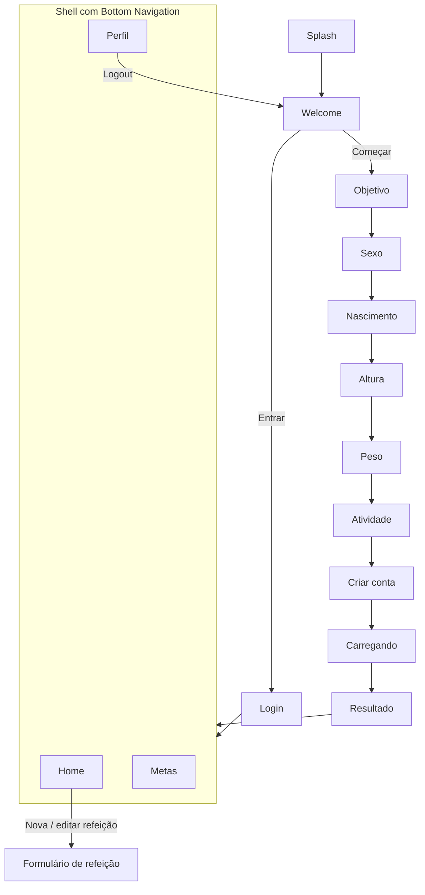

# Oz — Contador de Calorias

Aplicativo mobile em Flutter para acompanhamento diário de calorias e
macronutrientes (carboidratos, proteínas e gorduras). A partir de um
onboarding curto, o app calcula a meta calórica do usuário e permite
registrar, editar e excluir refeições, acompanhando o progresso do dia.

> **Fase 1 — Interface e navegação.** Nesta etapa o app não tem backend:
> todos os dados ficam em memória (mocks) e são perdidos ao fechar o app.

---

## Sumário

1. [Funcionalidades](#funcionalidades)
2. [Instalação e configuração](#instalação-e-configuração)
3. [Arquitetura e padrão de projeto](#arquitetura-e-padrão-de-projeto)
4. [Navegação entre páginas](#navegação-entre-páginas)
5. [Validações, mensagens de erro e tratamento de dados](#validações-mensagens-de-erro-e-tratamento-de-dados)
6. [Particularidades, limitações e bugs conhecidos](#particularidades-limitações-e-bugs-conhecidos)
7. [Equipe e atividades desenvolvidas](#equipe-e-atividades-desenvolvidas)

---

## Funcionalidades

- **Splash e boas-vindas** com opção de criar conta ou entrar.
- **Login** com validação de e-mail e senha.
- **Onboarding em 7 etapas**: objetivo, sexo, data de nascimento, altura,
  peso, nível de atividade e criação de conta, seguido de tela de
  carregamento e resultado com a meta calculada.
- **Cálculo de metas** pela fórmula de Mifflin-St Jeor × fator de atividade,
  com ajuste pelo objetivo (−500 kcal para perder, +300 kcal para ganhar) e
  distribuição de macros (2,2 g de proteína/kg, 25% das calorias em gordura,
  restante em carboidratos).
- **Home** com seletor de dia, gráfico de calorias/macros consumidos e lista
  de refeições do dia.
- **Refeições**: cadastro, edição e exclusão (com diálogo de confirmação).
- **Metas**: edição manual da meta de calorias e de macros.
- **Perfil**: edição de nome, altura e peso, com recálculo das metas quando
  peso ou altura mudam, e logout.
- **Internacionalização** em português (pt-BR) e inglês (en-US).
- **Tema escuro** com tokens de cor e tipografia (fonte Host Grotesk).

---

## Instalação e configuração

### Pré-requisitos

| Ferramenta                  | Versão                                     |
| --------------------------- | ------------------------------------------ |
| Flutter SDK                 | 3.47 ou superior (canal stable)            |
| Dart SDK                    | ^3.13.2 (já incluso no Flutter)            |
| Android Studio **ou** Xcode | Para emuladores/simuladores e build nativo |
| Git                         | Qualquer versão recente                    |

Confira se o ambiente está pronto:

```bash
flutter doctor
```

### Passo a passo

1. **Clone o repositório**

   ```bash
   git clone <url-do-repositorio>
   cd oz_contador_de_calorias
   ```

2. **Instale as dependências**

   ```bash
   flutter pub get
   ```

   Como o `pubspec.yaml` usa `generate: true`, esse comando também gera as
   classes de tradução em `lib/configs/l10n/` a partir dos arquivos `.arb`.
   Se precisar gerá-las manualmente:

   ```bash
   flutter gen-l10n
   ```

3. **Abra um emulador/simulador ou conecte um dispositivo**

   ```bash
   flutter devices
   ```

4. **Execute o app**

   ```bash
   flutter run
   ```

### Build de release (opcional)

```bash
# Android (APK)
flutter build apk --release

# iOS (requer macOS + Xcode e conta de desenvolvedor configurada)
flutter build ios --release
```

### Configurações relevantes

| Item                   | Onde fica                                        | Observação                                                                 |
| ---------------------- | ------------------------------------------------ | -------------------------------------------------------------------------- |
| Dependências           | `pubspec.yaml`                                   | `provider`, `intl`, `uuid`, `flutter_localizations`                        |
| Traduções              | `lib/configs/l10n/app_pt.arb`, `app_en.arb`      | `app_pt.arb` é o arquivo base (ver `l10n.yaml`)                            |
| Tema e cores           | `lib/configs/theme/`                             | Apenas tema escuro                                                         |
| Constantes de nutrição | `lib/configs/constants/nutrition_constants.dart` | Fatores de atividade, limites de altura/peso/idade, tolerância de calorias |
| Constantes de UI       | `lib/configs/constants/app_constants.dart`       | Espaçamentos, raios, durações de splash/loading                            |
| Dados de exemplo       | `lib/mocks/`                                     | Perfil e refeições pré-carregados                                          |
| Idioma                 | Sistema do dispositivo                           | O app segue o idioma do aparelho (pt-BR ou en-US)                          |

Não há variáveis de ambiente, chaves de API ou backend a configurar nesta fase.

---

## Arquitetura e padrão de projeto

O projeto segue o padrão **MVC (Model–View–Controller)** com gerenciamento de
estado via **Provider**:

| Camada         | Pasta                        | Responsabilidade                                                                                                                     |
| -------------- | ---------------------------- | ------------------------------------------------------------------------------------------------------------------------------------ |
| **Model**      | `lib/models/`                | Entidades imutáveis (`UserProfile`, `Meal`, `DailyLog`, `NutritionGoal`) e enums (`GoalType`, `Gender`, `ActivityLevel`, `MealType`) |
| **View**       | `lib/pages/`, `lib/widgets/` | Telas e componentes reutilizáveis; só exibem dados e repassam ações aos controllers                                                  |
| **Controller** | `lib/controllers/`           | `ChangeNotifier`s que guardam o estado e as regras de cada fluxo                                                                     |
| **Services**   | `lib/services/`              | Lógica pura e testável: cálculo nutricional, validadores e utilitários de data                                                       |

### Estrutura de pastas

```
lib/
├── main.dart                 # Ponto de entrada
├── app.dart                  # MultiProvider, MaterialApp, tema, i18n e rotas
├── configs/
│   ├── constants/            # Constantes de UI e de nutrição
│   ├── l10n/                 # Traduções (.arb) e classes geradas
│   ├── routes/               # Nomes de rotas e RouteGenerator
│   └── theme/                # Cores, tipografia e ThemeData
├── controllers/              # Session, Onboarding, Profile, DailyLog, Meal
├── mocks/                    # Dados em memória da Fase 1
├── models/                   # Entidades e enums
├── pages/                    # Uma pasta por tela/fluxo
├── services/                 # NutritionCalculator, Validators, DateUtils
└── widgets/                  # Botões, inputs, cards, gráficos, navbar, etc.
```

### Controllers

| Controller             | Responsabilidade                                                                                                   |
| ---------------------- | ------------------------------------------------------------------------------------------------------------------ |
| `SessionController`    | Estado de autenticação (login/logout)                                                                              |
| `OnboardingController` | Guarda as respostas do onboarding e monta o `UserProfile`                                                          |
| `ProfileController`    | Perfil do usuário e metas; recalcula metas quando peso/altura mudam                                                |
| `DailyLogController`   | Dia selecionado na Home e refeições agrupadas por dia                                                              |
| `MealController`       | CRUD de refeições e validação calorias × macros; depende do `DailyLogController` via `ChangeNotifierProxyProvider` |

---

## Navegação entre páginas

A navegação usa **rotas nomeadas** (`lib/configs/routes/app_routes.dart`)
resolvidas por um `RouteGenerator` central (`onGenerateRoute`). Rotas
desconhecidas caem na Splash.



| Rota                                        | Tela                                                                               |
| ------------------------------------------- | ---------------------------------------------------------------------------------- |
| `/`                                         | Splash                                                                             |
| `/welcome`                                  | Boas-vindas                                                                        |
| `/login`                                    | Login                                                                              |
| `/onboarding/goal` … `/onboarding/account`  | 7 etapas do onboarding                                                             |
| `/onboarding/loading`, `/onboarding/result` | Cálculo e resultado da meta                                                        |
| `/main`                                     | Shell com abas Home, Metas e Perfil (`IndexedStack` preserva o estado de cada aba) |
| `/meal/form`                                | Cadastro de refeição; recebe um `Meal` opcional como argumento para edição         |

Após login, conclusão do onboarding e logout, a pilha de navegação é limpa
(`pushNamedAndRemoveUntil`) para impedir que o botão "voltar" retorne a
telas de autenticação ou ao app após sair.

---

## Validações, mensagens de erro e tratamento de dados

### Validadores

Os validadores ficam em `lib/services/validators.dart` e retornam erros
**tipados e independentes de idioma** (`sealed class ValidationError`). A
tradução para texto acontece na camada de View
(`lib/configs/l10n/l10n_extensions.dart`), então a mesma regra exibe a
mensagem em pt-BR ou en-US.

| Campo                          | Regra                                                                                 | Mensagem de erro                                |
| ------------------------------ | ------------------------------------------------------------------------------------- | ----------------------------------------------- |
| Obrigatórios (nome, descrição) | Não pode ser vazio/só espaços                                                         | Campo obrigatório                               |
| E-mail                         | Formato `usuario@dominio.ext`                                                         | E-mail inválido                                 |
| Senha                          | Mínimo de 8 caracteres                                                                | Senha muito curta                               |
| Confirmação de senha           | Igual à senha                                                                         | As senhas não coincidem                         |
| Data de nascimento             | Formato `DD/MM/AAAA`, data existente, não futura, idade entre 13 e 100 anos           | Data inválida / Idade fora do intervalo         |
| Altura                         | Número entre 100 e 250 cm                                                             | Fora do intervalo (mín–máx)                     |
| Peso                           | Número entre 30 e 300 kg                                                              | Fora do intervalo (mín–máx)                     |
| Calorias (refeição/meta)       | Número maior que zero                                                                 | Deve ser positivo                               |
| Macros (refeição/meta)         | Número maior ou igual a zero                                                          | Não pode ser negativo                           |
| Calorias × macros (refeição)   | Calorias informadas devem bater com `4·carb + 4·prot + 9·gord` com tolerância de ±10% | Calorias não conferem (mostra o valor esperado) |

### Tratamento de variáveis e entrada de dados

- **Números decimais** aceitam vírgula ou ponto (`Validators.parseDecimal`),
  e texto inválido vira `null` em vez de lançar exceção.
- **Datas** são digitadas com máscara (`DateTextInputFormatter`) e datas
  inexistentes (ex.: 31/02) são rejeitadas.
- **Campos nulos no onboarding**: o `OnboardingController` usa campos
  anuláveis e só monta o perfil quando `isComplete` é verdadeiro; caso
  contrário lança `StateError`, evitando perfis parciais.
- **Botões de avançar** ficam desabilitados enquanto a etapa atual não é
  válida (ex.: nenhuma opção selecionada, altura fora do intervalo).
- **Textos** passam por `trim()` antes de serem salvos.
- **Seletor de dia** nunca permite escolher uma data futura.
- **Ações destrutivas** (excluir refeição, logout, alterar peso/altura que
  recalcula metas) pedem confirmação em diálogo.
- **Feedback** de sucesso (refeição salva, metas atualizadas, perfil
  atualizado) é exibido via `SnackBar`.

---

## Particularidades, limitações e bugs conhecidos

### Particularidades

- **Sem persistência:** perfil, metas e refeições ficam só em memória.
  Fechar o app restaura os dados de exemplo em `lib/mocks/`.
- **Autenticação simulada:** o login aceita qualquer e-mail/senha que passe
  na validação. O e-mail e a senha da tela "Crie sua conta" são validados,
  mas não são armazenados.
- **Dados de exemplo:** ao abrir o app, o perfil mockado e refeições dos dois
  dias anteriores já estão carregados, para que a Home e o histórico tenham
  conteúdo desde o início.
- **Idioma automático:** não há seletor de idioma no app; ele segue o idioma
  do sistema (pt-BR ou en-US).

### Funcionalidades faltantes (previstas para as próximas fases)

- Backend/banco de dados para persistir usuários, metas e refeições.
- Autenticação real (cadastro, login, recuperação de senha).
- Cadastro de refeições em dias anteriores: novas refeições são sempre
  registradas no dia de hoje.
- Busca de alimentos em uma base nutricional (hoje os valores são digitados
  manualmente).
- Tema claro.
- Testes automatizados (o teste padrão do template foi removido e ainda não
  há testes de widget/unidade).

### Bugs e limitações conhecidos

- Ao entrar pelo **login**, o app exibe o perfil mockado, e não os dados de
  uma conta criada anteriormente no onboarding (consequência da ausência de
  backend).
- O `SessionController` guarda o estado de autenticação, mas as rotas ainda
  não são protegidas por ele: a proteção atual depende apenas da limpeza da
  pilha de navegação.
- O **logout** encerra a sessão, mas mantém perfil, metas e refeições em
  memória até o app ser fechado.

---

## Equipe e atividades desenvolvidas

| Integrante           | Atividades                                                                                                                                                                                                                                                                                                                                                                        |
| -------------------- | --------------------------------------------------------------------------------------------------------------------------------------------------------------------------------------------------------------------------------------------------------------------------------------------------------------------------------------------------------------------------------- |
| **Gabriel Siqueira** | Estrutura do projeto e padrão MVC; models, enums e mocks; controllers com Provider; cálculo nutricional (Mifflin-St Jeor); validadores e tratamento de dados; tema, tipografia e componentes reutilizáveis; internacionalização pt-BR/en-US; telas de splash, boas-vindas, login e onboarding; Home, refeições, metas e perfil; rotas nomeadas e navegação com bottom navigation. |

---

## Tecnologias

- [Flutter](https://flutter.dev/) / Dart
- [provider](https://pub.dev/packages/provider) — gerenciamento de estado
- [intl](https://pub.dev/packages/intl) + `flutter_localizations` — i18n e formatação de datas/números
- [uuid](https://pub.dev/packages/uuid) — identificadores de refeições
- Fonte [Host Grotesk](https://fonts.google.com/specimen/Host+Grotesk) (licença OFL)
