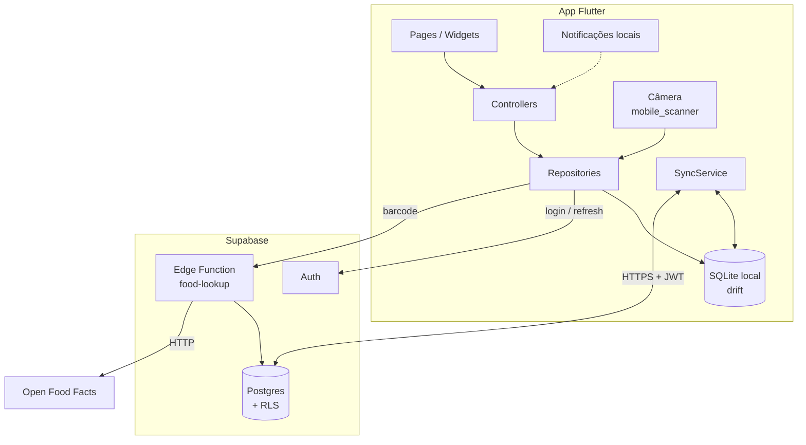
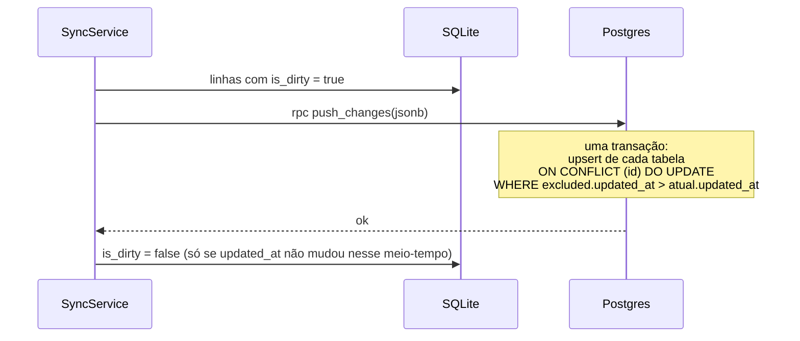
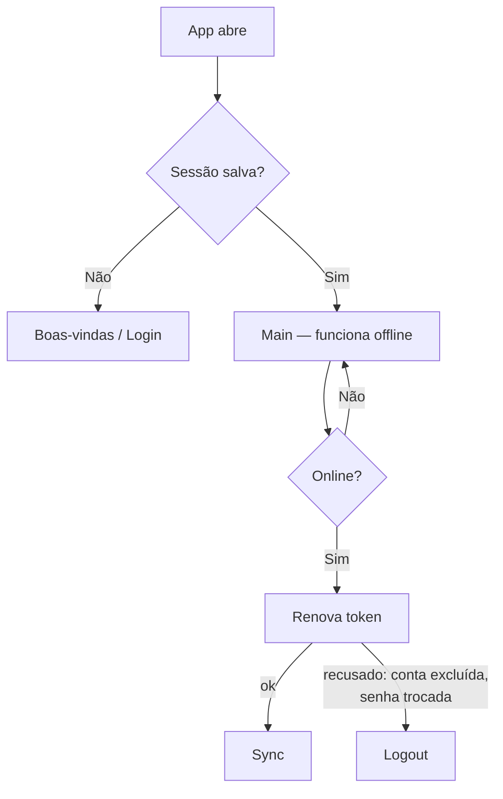
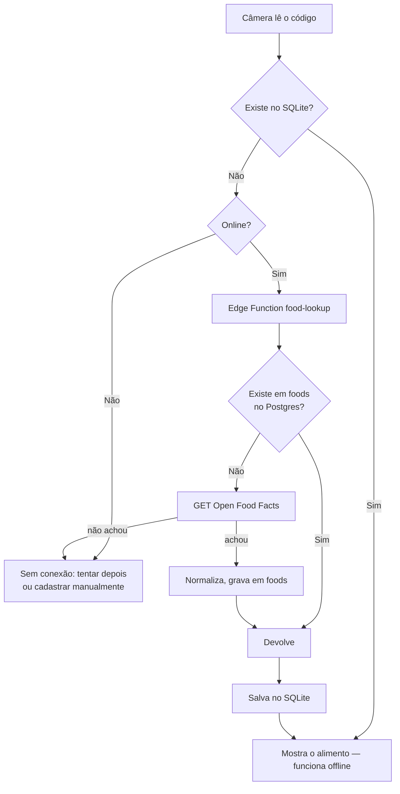

# Arquitetura — Entregas 2 e 3

Documento de decisões de arquitetura do Oz para as fases de banco de dados,
autenticação, API externa e recursos nativos. Nada aqui está implementado
ainda; serve de referência para a implementação e para o relatório.

> **Status:** decisões aprovadas. A [Monetização](#10-monetização) e a
> [Visão futura](#11-visão-futura) ficam para depois da Entrega 3.

---

## Sumário

1. [Requisitos das entregas](#1-requisitos-das-entregas)
2. [Visão geral](#2-visão-geral)
3. [Decisões e justificativas](#3-decisões-e-justificativas)
4. [Modelo de dados](#4-modelo-de-dados)
5. [Sincronização offline-first](#5-sincronização-offline-first)
6. [Autenticação e sessão](#6-autenticação-e-sessão)
7. [Leitura de código de barras](#7-leitura-de-código-de-barras)
8. [Lembretes de refeição](#8-lembretes-de-refeição)
9. [Evolução de peso e histórico de metas](#9-evolução-de-peso-e-histórico-de-metas)
10. [Monetização](#10-monetização)
11. [Visão futura](#11-visão-futura)
12. [Ordem de implementação](#12-ordem-de-implementação)
13. [Novas dependências](#13-novas-dependências)

---

## 1. Requisitos das entregas

| Entrega | Requisito                                                                 | Como o Oz atende                                                          |
| ------- | ------------------------------------------------------------------------- | ------------------------------------------------------------------------- |
| **2**   | Integração com banco de dados (online ou offline)                         | SQLite local (drift) + Postgres no Supabase, sincronizados                |
| **2**   | Autenticação protegendo o acesso às funcionalidades                       | Supabase Auth (e-mail/senha e Google) com regras de acesso por usuário    |
| **3**   | API externa via HTTP **ou** Cloud/Lambda Functions                        | Edge Function `food-lookup` que consulta a Open Food Facts via HTTP       |
| **3**   | Recursos nativos que façam sentido para o app                             | Câmera (leitura de código de barras) e notificações locais (lembretes)    |

---

## 2. Visão geral



**A UI só lê e grava no SQLite local.** Toda gravação é instantânea e
funciona offline; o `SyncService` envia e recebe mudanças do servidor em
segundo plano. A interface `Repository` continua sendo a fronteira: os
controllers não sabem se o dado veio do disco ou da rede.

---

## 3. Decisões e justificativas

| Decisão                         | Escolha                                      | Por quê                                                                                                          |
| ------------------------------- | -------------------------------------------- | ---------------------------------------------------------------------------------------------------------------- |
| Banco local                     | **SQLite com drift**                         | Funciona offline, UI responde na hora, busca local rápida com FTS5; drift dá tipagem, migrations e streams       |
| Backend                         | **Supabase**                                 | Postgres relacional (mesmo formato do SQLite local), Auth e Edge Functions inclusos, sem lock-in (Postgres comum) |
| Alternativas descartadas        | Firebase; backend próprio                    | Firestore é NoSQL e já tem cache offline próprio (SQLite ficaria redundante); backend próprio aumenta risco de falha, deploy e segurança para um dev só |
| Sincronização                   | **Implementação própria**                    | Dados são de um único usuário, conflitos são raros; simples de explicar; evita mais um serviço (ex.: PowerSync)  |
| Conflitos                       | **Última edição vence** (por `updated_at`)   | Só acontece se o mesmo usuário editar o mesmo registro em dois aparelhos offline                                 |
| IDs                             | **UUID gerado no app**                       | Registro criado offline já tem ID definitivo; reenvios caem na mesma linha                                       |
| Idempotência                    | **PK + constraints únicas + upsert**         | Reenvio da fila nunca duplica; `UNIQUE` em chaves naturais cobre duplicatas com IDs diferentes                   |
| Exclusão                        | **Soft delete** (`deleted_at`)               | A exclusão precisa chegar aos outros aparelhos                                                                   |
| Catálogo TACO                   | **Embarcado no app**                         | ~600 alimentos, algumas centenas de KB; busca funciona offline                                                   |
| Enums no Postgres               | **`text` + `CHECK`**                         | Mais fácil acrescentar valores que `CREATE TYPE ... AS ENUM`                                                     |
| Leitura nas regras de acesso    | **Função `can_read_user(target)`**           | Hoje só compara com `auth.uid()`; na [plataforma para nutricionistas](#plataforma-para-nutricionistas) basta trocar a função, sem reescrever as policies |

> **Sobre escala:** um contador de calorias gera pouca carga. Com 10 mil
> usuários ativos/dia, ~5 refeições de ~3 alimentos cada, são ~150 mil linhas
> novas por dia — trivial para um Postgres gerenciado. Como o app é
> offline-first, uma queda do servidor não interrompe o uso. Os riscos reais
> são segurança (RLS), limites do plano gratuito (o projeto **pausa após
> ~1 semana sem uso**) e manutenção.

---

## 4. Modelo de dados

### Colunas comuns

Toda tabela de dados do usuário tem:

| Coluna              | Tipo          | Origem   | Uso                                                                  |
| ------------------- | ------------- | -------- | -------------------------------------------------------------------- |
| `id`                | `uuid` PK     | App      | Identidade do registro, igual no aparelho e no servidor              |
| `user_id`           | `uuid`        | App      | Dono do registro; base das regras de acesso (RLS)                    |
| `created_at`        | `timestamptz` | App      | Data de criação                                                      |
| `updated_at`        | `timestamptz` | App      | Decide qual edição vence num conflito                                |
| `deleted_at`        | `timestamptz` | App      | Exclusão lógica; `null` = ativo                                      |
| `server_updated_at` | `timestamptz` | Servidor | Preenchido por trigger com `now()`; cursor do "o que mudou desde X?" |

> **Por que duas datas de atualização?** O cursor de download usa o relógio
> do **servidor**. Se usasse o do celular, uma edição feita offline ontem e
> enviada hoje teria data antiga e nunca seria baixada pelos outros
> aparelhos. O `updated_at` do app serve só para resolver conflitos.

### Tabelas do servidor (Postgres)

```sql
-- Perfil: id é o próprio usuário do Auth
profiles (
  id              uuid PK REFERENCES auth.users,
  name            text NOT NULL,
  goal            text NOT NULL CHECK (goal IN ('lose','maintain','gain')),
  gender          text NOT NULL CHECK (gender IN ('male','female')),
  birth_date      date NOT NULL,
  activity_level  text NOT NULL CHECK (activity_level IN
                    ('sedentary','light','moderate','heavy','athlete')),
  height_cm       numeric NOT NULL CHECK (height_cm BETWEEN 100 AND 250),
  -- + colunas comuns (exceto user_id, que é o próprio id)
)

-- Histórico de metas: a meta vigente é a de maior effective_from <= hoje
nutrition_goals (
  calories        int     NOT NULL CHECK (calories > 0),
  carbs_g         numeric NOT NULL CHECK (carbs_g >= 0),
  protein_g       numeric NOT NULL CHECK (protein_g >= 0),
  fat_g           numeric NOT NULL CHECK (fat_g >= 0),
  effective_from  date    NOT NULL,
  UNIQUE (user_id, effective_from)
)

-- Peso: uma medição por dia; o peso atual é a mais recente
weight_entries (
  measured_on     date    NOT NULL,
  weight_kg       numeric NOT NULL CHECK (weight_kg BETWEEN 30 AND 300),
  UNIQUE (user_id, measured_on)
)

meals (
  type            text NOT NULL CHECK (type IN
                    ('breakfast','lunch','dinner','snack')),
  eaten_at        timestamptz NOT NULL,
  local_date      date NOT NULL   -- dia no fuso do usuário; agrupa a Home
)

meal_items (
  meal_id         uuid NOT NULL REFERENCES meals ON DELETE CASCADE,
  food_id         uuid NULL REFERENCES foods,  -- referência, pode sumir
  position        int  NOT NULL,
  -- cópia do alimento: correções na base não alteram o histórico
  food_name       text    NOT NULL,
  kcal_100g       numeric NOT NULL,
  carbs_100g      numeric NOT NULL,
  protein_100g    numeric NOT NULL,
  fat_100g        numeric NOT NULL,
  portion_unit    text    NOT NULL,
  portion_grams   numeric NOT NULL CHECK (portion_grams > 0),
  quantity        numeric NOT NULL CHECK (quantity > 0)
)

-- Catálogo: público (owner_id null) ou criado pelo usuário
foods (
  id              uuid PK,
  source          text NOT NULL CHECK (source IN ('taco','off','custom')),
  source_ref      text NULL,          -- id na TACO ou código na OFF
  barcode         text NULL UNIQUE,
  owner_id        uuid NULL REFERENCES auth.users,
  name            text NOT NULL,
  emoji           text NULL,
  kcal_100g       numeric NOT NULL,
  carbs_100g      numeric NOT NULL,
  protein_100g    numeric NOT NULL,
  fat_100g        numeric NOT NULL,
  UNIQUE (source, source_ref)
)

food_portions (
  id              uuid PK,
  food_id         uuid NOT NULL REFERENCES foods ON DELETE CASCADE,
  unit            text NOT NULL,      -- PortionUnit, + 'serving' (porção da embalagem)
  grams           numeric NOT NULL CHECK (grams > 0),
  UNIQUE (food_id, unit, grams)
)
```

Observações:

- `meal_items.user_id` é redundante com `meals.user_id` de propósito: a regra
  de acesso fica direta, sem subconsulta.
- `profiles` perde a coluna de peso; o peso atual vem de `weight_entries`.
- `DailyLog` **não vira tabela**: é o agrupamento de `meals` por `local_date`.
  Guardar o dia local evita que uma refeição das 23h caia no dia seguinte por
  causa do fuso.
- Novo valor em `PortionUnit`: `serving` (porção informada na embalagem, vinda
  da Open Food Facts).

### Regras de acesso (RLS)

A leitura de dados do usuário passa sempre por uma função, para que o acesso
possa ser ampliado no futuro sem reescrever as policies:

```sql
create function can_read_user(target uuid) returns boolean
  language sql stable security definer
  as $$ select target = auth.uid() $$;
```

| Tabela                                                                        | Leitura                               | Escrita                                  |
| ----------------------------------------------------------------------------- | ------------------------------------- | ---------------------------------------- |
| `profiles`                                                                    | `can_read_user(id)`                   | `id = auth.uid()`                        |
| `nutrition_goals`, `weight_entries`, `meals`, `meal_items`                    | `can_read_user(user_id)`              | `user_id = auth.uid()`                   |
| `foods`, `food_portions`                                                      | `owner_id IS NULL OR owner_id = auth.uid()` | Só alimentos `custom` do próprio dono; `taco` e `off` só pela Edge Function (service role) |

### Banco local (drift)

As mesmas tabelas, com as diferenças:

| Item                 | Local                                                              |
| -------------------- | ------------------------------------------------------------------ |
| `is_dirty` (bool)    | Linha alterada localmente e ainda não enviada                      |
| `server_updated_at`  | Guardado como veio do servidor (não é gerado localmente)           |
| `sync_state`         | Tabela de uma linha com o último `server_updated_at` recebido      |
| `foods_fts`          | Tabela virtual FTS5 para busca sem acento/maiúsculas               |
| `reminder_settings`  | Horários dos lembretes; **só local**, não sincroniza               |
| Seed                 | Catálogo TACO carregado na primeira execução a partir de um asset |

---

## 5. Sincronização offline-first

### Gravação local

1. O repositório grava no SQLite com `updated_at = agora` e `is_dirty = true`.
2. A UI atualiza na hora (streams do drift).
3. O `SyncService` é agendado para rodar alguns segundos depois.

Usar `is_dirty` em vez de uma fila de operações faz com que cinco edições
offline da mesma refeição subam **uma vez**, com o estado final, sem depender
da ordem das operações.

### Envio (push)



- **Uma transação por envio.** Refeição e itens sobem juntos; nunca aparece uma
  refeição sem itens em outro aparelho.
- **Idempotente.** Se a resposta se perder e o app reenviar, o `ON CONFLICT`
  cai na mesma linha.
- **Edição antiga não sobrescreve nova.** O `WHERE excluded.updated_at > ...`
  ignora reenvios desatualizados.
- **Duplicatas com IDs diferentes.** Para registros com chave natural
  (`weight_entries`, `nutrition_goals`), o ID é um **UUID v5 derivado de
  `user_id` + data**. Dois aparelhos que registram o peso do mesmo dia offline
  geram o mesmo ID, e o conflito é resolvido pela PK.

### Download (pull)

1. `SELECT ... WHERE server_updated_at > :cursor` em cada tabela do usuário.
2. Para cada linha recebida: se a linha local estiver `is_dirty` e tiver
   `updated_at` maior, mantém a local (ela sobe no próximo push); senão, aplica.
3. Atualiza o cursor em `sync_state` com o maior `server_updated_at` recebido.

### Quando o sync roda

- Ao abrir o app e após o login.
- Quando a conexão volta (`connectivity_plus`).
- Alguns segundos após cada gravação local (debounce).
- Antes do logout (ver abaixo).

---

## 6. Autenticação e sessão



- **Login offline:** a tela de entrada verifica se **existe uma sessão salva**,
  e não se o token de acesso (~1 h) ainda é válido. Um usuário que já fez login
  continua usando o app e registrando refeições sem internet. O token é
  renovado quando a rede volta.
- **O primeiro login exige internet.**
- **Armazenamento da sessão:** `flutter_secure_storage` (Keychain no iOS,
  Keystore no Android), no lugar do SharedPreferences padrão do Supabase.
- **Provedores:** e-mail/senha e Google (o botão já existe na tela de
  boas-vindas como "em breve").
- **Onboarding:** a tela "Crie sua conta" passa a criar a conta de verdade; as
  respostas do onboarding viram o primeiro `profiles`, `nutrition_goals` e
  `weight_entries`.

### Logout

1. Tenta sincronizar.
2. Se ainda houver linhas `is_dirty` (ex.: sem internet), mostra:
   *"Você tem X registros não enviados. Se sair agora, eles serão perdidos."*
3. Apaga as **tabelas do usuário** e `sync_state`. O catálogo TACO fica, pois é
   igual para todos.
4. Cancela os lembretes agendados.

O motivo de apagar é **privacidade**: outra pessoa pode entrar no mesmo
aparelho, e os dados de usuários diferentes não podem se misturar.

---

## 7. Leitura de código de barras



- A TACO não tem código de barras; a leitura serve para **produtos
  industrializados**.
- **Dados incompletos:** se a Open Food Facts não tiver todos os macros, abre o
  cadastro manual já preenchido com o que veio.
- **Porção da embalagem:** o campo de porção da OFF (ex.: "1 barra = 25 g") vira
  uma `food_portions` com `unit = 'serving'`.
- **Por que passar pela Edge Function:** a OFF pede um User-Agent identificando
  o app e limita requisições; a tabela `foods` funciona como cache
  compartilhado — o produto escaneado por um usuário fica disponível para
  todos.
- **Pacote:** `mobile_scanner`. Permissão de câmera pedida só ao tocar em
  "Escanear".

---

## 8. Lembretes de refeição

- **Agendados no próprio aparelho** com `flutter_local_notifications` +
  `timezone`: não dependem de servidor e funcionam offline.
- **Horários configuráveis** por tipo de refeição (padrão: café 8h, almoço
  12h30, jantar 19h30; lanche desligado).
- **Não incomodar quem já registrou:** os lembretes são agendados um a um para
  os **próximos 7 dias** (não como alarme diário repetido). Ao registrar o
  almoço de hoje, o app cancela só o lembrete do almoço de hoje. Ao abrir o app,
  a janela de 7 dias é reagendada. 3 refeições × 7 dias = 21 agendamentos,
  abaixo do limite de 64 do iOS.
- **Permissão:** pedida no fim do onboarding, explicando o motivo (obrigatória
  no Android 13+ e no iOS).
- **Configuração só local** (`reminder_settings`): cada aparelho tem a sua.

---

## 9. Evolução de peso e histórico de metas

- **Peso:** `weight_entries`, uma medição por dia. O perfil mostra o mais
  recente. Ao registrar um peso novo, as metas são recalculadas (com
  confirmação, como hoje no Perfil).
- **Gráfico:** linha do peso ao longo do tempo com `fl_chart`, com filtros de
  período (30 dias, 90 dias, tudo).
- **Metas:** `nutrition_goals` guarda o histórico (`effective_from`). Toda
  alteração — manual na aba Metas ou recálculo pelo peso — cria ou atualiza a
  linha do dia. Permite, no futuro, um gráfico de meta × consumido.

---

## 10. Monetização

Implementada **depois da Entrega 3**, para que as entregas não dependam disso.

| Decisão              | Escolha                                                                                   |
| -------------------- | ----------------------------------------------------------------------------------------- |
| Modelo               | **Híbrido**: gratuito com banner discreto na Home + plano premium                         |
| Lançamento           | **Android primeiro** (US$ 25 uma vez); iOS quando houver usuários que justifiquem a conta |
| Preço de referência  | **R$ 9,90/mês** ou **R$ 59,90/ano**                                                       |
| Compras              | RevenueCat (`purchases_flutter`)                                                          |
| Anúncios             | AdMob (`google_mobile_ads`); sem anúncio de tela cheia ao salvar refeição                 |

| Gratuito                                  | Premium                                              |
| ----------------------------------------- | ---------------------------------------------------- |
| Registro de refeições e busca de alimentos | Sem anúncios                                         |
| Metas e recálculo                         | Gráficos com histórico completo (grátis: 30 dias)    |
| Sincronização entre aparelhos             | Comparativo meta × consumido                         |
| Lembretes de refeição                     | Exportar dados em CSV                                |
| Leitura de código de barras               | Alimentos personalizados ilimitados                  |
| Gráfico de peso (30 dias)                 | Sugestões de refeição ([Visão futura](#sugestões-de-refeição)) |

O que afeta a arquitetura:

- **Custos de publicação:** Apple Developer Program **US$ 99 por ano**
  (renovação anual, necessário inclusive para TestFlight); Google Play
  **US$ 25 uma única vez**.
- **Exigências da Apple que afetam a autenticação:** o app precisa permitir
  **excluir a conta pelo próprio app** e ter política de privacidade. Se houver
  compras: botão "Restaurar compras" e termos da assinatura visíveis.
- **Se houver anúncios:** consentimento de rastreamento no iOS (ATT) e
  consentimento LGPD/GDPR (UMP do Google).
- **Se houver assinatura:** uma tabela `entitlements` no Supabase atualizada por
  webhook (Edge Function) e um `EntitlementController` no app expondo
  `isPremium`, com cache local para funcionar offline.

---

## 11. Visão futura

Ideias para depois da Entrega 3. Nada aqui entra nas entregas da faculdade;
fica registrado para que as decisões de agora não impeçam essa evolução.

### Plataforma para nutricionistas

O nutricionista acompanha os pacientes por um **painel web**: refeições,
peso, metas e, numa segunda etapa, o plano alimentar que ele mesmo monta.

**Modelo de negócio:** o nutricionista assina o plano profissional; os
pacientes vinculados a ele ganham o premium sem custo. Cada profissional traz
vários pacientes, o que faz o app crescer sem depender só de anúncios.

**Primeiro produto (MVP):**

1. O paciente gera um código de convite no app.
2. O nutricionista usa o código no painel e passa a ver refeições, peso e
   metas, **somente leitura**.
3. Depois: plano alimentar montado no painel, exibido no app do paciente com
   comparativo previsto × consumido.

**Impacto na arquitetura:**

- Nova tabela de vínculo, por exemplo
  `care_links (nutritionist_id, patient_id, status, consented_at, revoked_at)`.
- `can_read_user` passa a ser: o próprio usuário **ou** existe vínculo ativo
  com consentimento. As policies das tabelas não mudam.
- A escrita continua só do dono: o nutricionista não altera registros do
  paciente.
- Tabelas próprias para o plano alimentar (`diet_plans`, itens por refeição),
  escritas pelo nutricionista e lidas pelo paciente.
- O painel é web (o nutricionista atende no computador); Flutter Web ou um
  front separado, a decidir.

**Cuidados:**

- **LGPD:** dados de saúde são dados pessoais sensíveis (art. 11).
  Consentimento específico para o compartilhamento, revogação a qualquer
  momento e registro de cada acesso do profissional.
- **Verificação do CRN** no cadastro do nutricionista.
- **Concorrência:** já existem ferramentas no Brasil (ex.: Dietbox, WebDiet)
  com app para o paciente. O diferencial do Oz seria o registro diário
  prático. Validar com alguns nutricionistas antes de construir.

### Sugestões de refeição

No Brasil, **prescrever dieta é atividade exclusiva do nutricionista**
(Lei 8.234/1991). Por isso o app **não gera dietas** sozinho; a ideia vira
duas funcionalidades seguras:

1. **Sugestões para completar o dia (premium):** "Faltam 40 g de proteína
   hoje. Opções que você costuma comer: frango (150 g), ovos (3 un.)…".
   Feito com regras simples a partir dos alimentos que o próprio usuário mais
   registra: sem IA, sem custo por uso e funcionando offline.
2. **Rascunho de plano por IA, revisado pelo nutricionista:** no painel, a IA
   sugere um plano com base no histórico do paciente; o nutricionista ajusta e
   aprova. Poupa tempo do profissional e mantém um responsável técnico pela
   prescrição.

---

## 12. Ordem de implementação

| # | Etapa                                                                 | Entrega |
| - | --------------------------------------------------------------------- | ------- |
| 1 | drift: schema local, seed da TACO, repositórios lendo/gravando no disco | 2       |
| 2 | Supabase: migrations, RLS, Auth e telas de login/cadastro reais       | 2       |
| 3 | `SyncService` (push, pull, logout seguro)                             | 2       |
| 4 | Registro de peso + gráfico de evolução + histórico de metas           | 3       |
| 5 | Lembretes de refeição                                                 | 3       |
| 6 | Leitura de código de barras + Edge Function `food-lookup`             | 3       |

---

## 13. Novas dependências

| Pacote                        | Uso                                              |
| ----------------------------- | ------------------------------------------------ |
| `drift`, `drift_flutter`      | SQLite tipado, migrations e streams              |
| `drift_dev`, `build_runner`   | Geração de código do drift (dev)                 |
| `supabase_flutter`            | Auth, Postgres (PostgREST/RPC) e Edge Functions  |
| `flutter_secure_storage`      | Armazenamento seguro da sessão                   |
| `connectivity_plus`           | Detectar volta da conexão para sincronizar       |
| `uuid` (já existe)            | IDs v4 e v5 gerados no app                       |
| `fl_chart`                    | Gráfico de evolução do peso                      |
| `flutter_local_notifications`, `timezone` | Lembretes agendados                  |
| `mobile_scanner`              | Leitura de código de barras pela câmera          |
